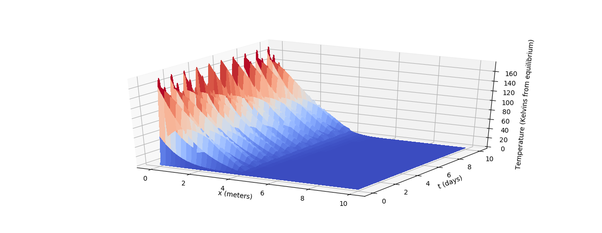

# HeatTest

This repository is for the heat test required for the computational physics internship. 

## Model
For simplicity I chose to model this system as heat transfer throughout a rod of 
lenght L with lateral insulation where the material of the rod, as well as its cross sectional area,
changes at the storage tank. Thus the area, density, thermal conductivity, and 
specific heat vary as a function of x. This gives us the PDE


I assume that the pump direction and the solar panel give a heat flux rightward through the rod so
d/dx U(xl) = f(t) where f(t) > 0 during the day, and non-positive at night. It is
my hope that this model captures the behavior of the system.

## Simulation
For this system, I will use Backward Euler to ensure consistency and stability 
considerations of the solution. Additionally, we have the flux condition at the solar panel given using
Forward Euler by


 
Because of the varying properties of the system, we must take care to use the correct physical properties at
any given spatial segment. The Backward Euler formula is then


where mu = k/h^2. The discussion above, writing mu_j = mu * A_j * k_j gives the finite difference scheme below:


Here I drop the source term because it complicates the simulation for this problem.
## Results
Suppose the length of the total system is 10 meters and the tank is located from
4 <= x <= 6. Below are the results for simulating using thermal diffusivity for the rod being 
22.8e-6 (iron) and diffusivity of the tank 0.75e-6 (concrete). The solar heat flux
is assumed to be 1000 W/m^2 (which is from https://ag.tennessee.edu/solar/Pages/What%20Is%20Solar%20Energy/Sun%27s%20Energy.aspx).
After scaling all units to days from seconds, we get the surfaces representing the evolution of heat over 10 days.


*Evolution of heat energy in the system*


*Evolution of heat energy in the tank*

This behavior appears physical given the parameters of the problem. Modeling the pump speed proved difficult.
One way to include this physical property is to multiply the thermal diffusivities by a factor larger than 1, 
after appropriately scaling the multipliers to follow A_1 v_1 = A_2 v_2.

## Dependencies
This project depends on an installation of `Python 3.7`. The following must also be
installed:
- `numpy`
- `matplotlib`
- `scipy`
- `mpl_toolkits`
## Running
To run, simply call `main.py` in a Python 3 interpreter when in the root directory of
this project. I run linux so my command is
```bash
python3 main.py
```
after `cd`ing to the root directory.