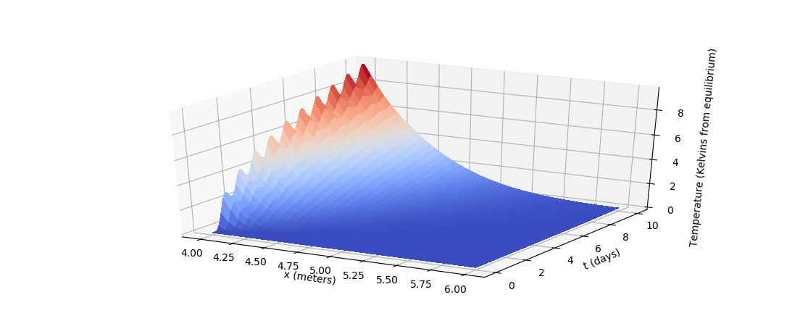

# HeatTest

This repository is for the heat test required for the computational physics internship. 

## Model
For simplicity I chose to model this system as heat transfer throughout a rod of 
lenght L with lateral insulation where the material of the rod changes at the storage tank. 
Thus the density, thermal conductivities, and 
specific heats vary as a function of x. For continuity I prescribe that the heat
at the endpoints be equal, i.e. U(xl) = U(xr). Additionally, the pump direction
and the solar panel give a heat flux rightward through the rod so
d/dx U(xl) = f(t) where f(t) > 0 during the day, and negative at night. It is
my hope that this model captures the behavior of the system.

## Simulation
For this system, I will use backward Euler to ensure consistency and stability 
considerations of the solution. Also, the solar flux is done using a centered difference about x = 0. 
The discussion above applied to Euler gives the finite difference scheme below:

Here Q is the source term, h is the x-step width, k is the t-step width, and lambda = beta * k / h^2 
where beta is the thermal diffusivity. Note that lambda changes for the different medium.
## Results
Suppose the length of the total system is 10 meters and the tank is located from
4 <= x <= 6. Below are the results for simulating using thermal diffusivity for the rod being 
22.8e-6 (iron) and diffusivity of the tank 0.75e-6 (concrete). The solar heat flux
is assumed to be 1000 (which is from https://ag.tennessee.edu/solar/Pages/What%20Is%20Solar%20Energy/Sun%27s%20Energy.aspx).
After scaling all units to days from seconds, we get the surfaces representing the evolution of heat over 3 days.

Evolution of heat energy in the system

Evolution of heat energy in the tank


## Dependencies
This project depends on an installation of `Python 3.7`. The following must also be
installed:
- `numpy`
- `matplotlib`
- `scipy`
- `mpl_toolkits`
## Running
To run, simply call `main.py` in a Python 3 interpreter when in the root directory of
this project. I run linux so my command is
```bash
python3 main.py
```
after `cd`ing to the root directory.